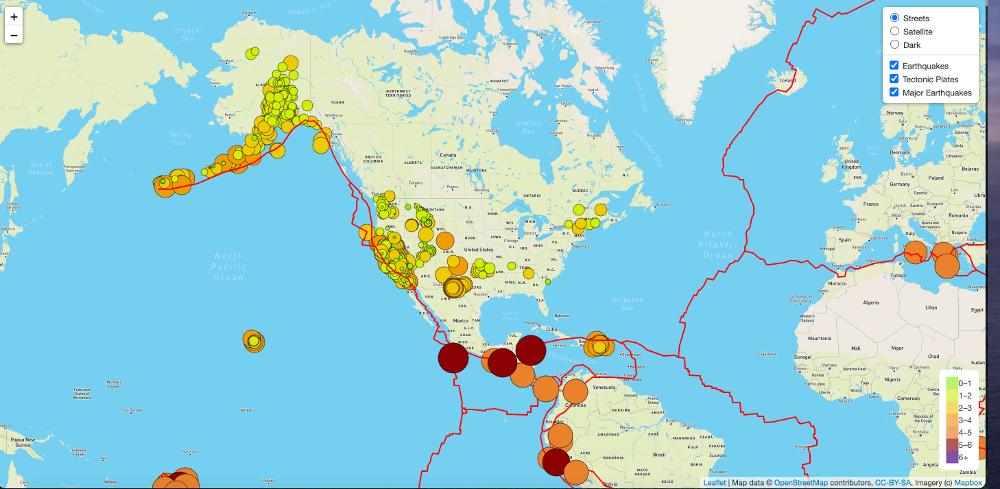
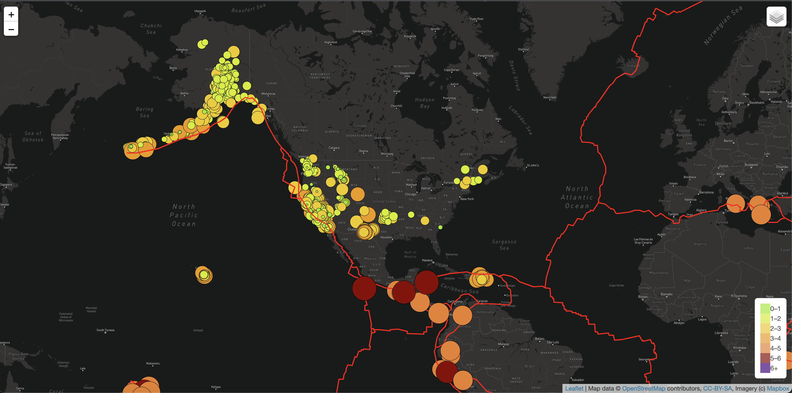
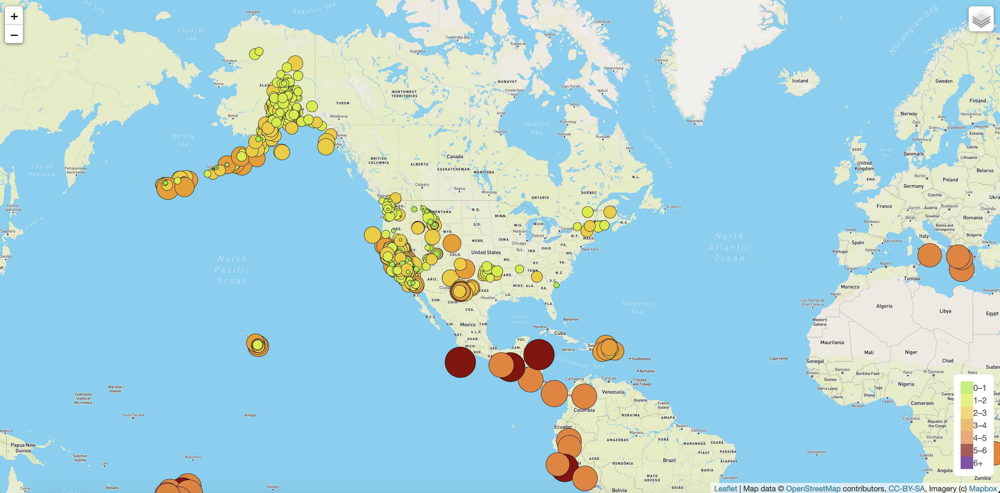
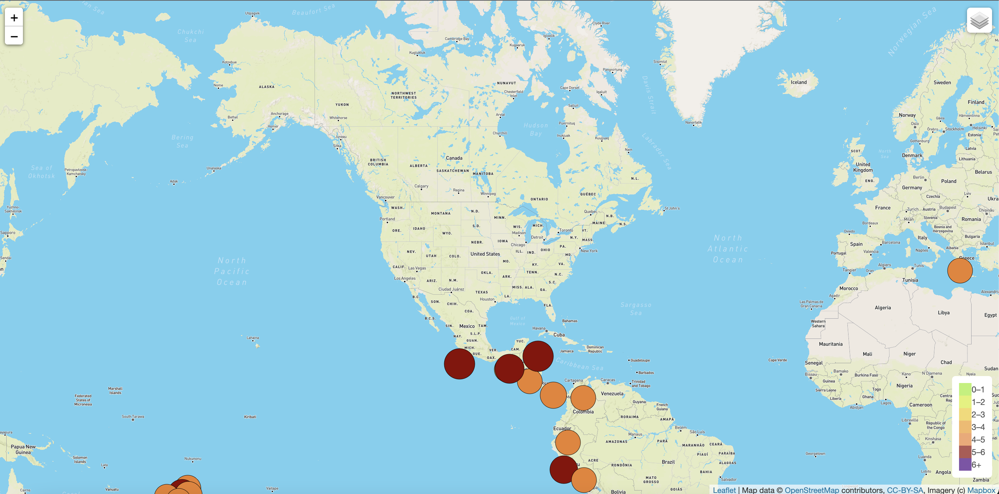
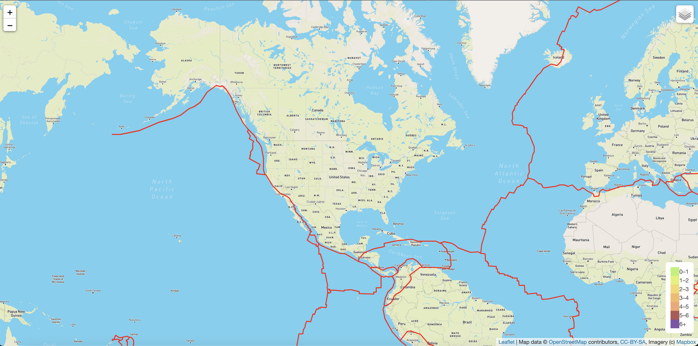

# Mapping_Earthquakes

## Overview
### Purpose
The goal is to visually show the earthquakes that have occurred around the world over the past 7 days and depict them according to the size of their magnitude.I have used GeoJSON earthquake data from the USGS website to retrieve geographical coordinates and the magnitudes of earthquakes for the last seven days and visualized it onto a world map. I also used the Leaflet library to plot the data on a Mapbox map through an API request and create interactivity for the earthquake data.

## Map Styles and Layers

### Map Styles
Users have the choice of viewing the earthquake data on a Streets, Satellite, or Dark map style. 
#### Streets Style:

#### Satellite Style:

#### Dark Style:

### Layers
User have the option to include all, some or none of the map layers. The options include viewing earthquakes of all magnititudes, major earthquakes (magniitude > 4.5), and the tectonic plate locations.
#### All Earthquakes:

#### Major Earthquakes:

#### Tectonic Plates:

#### Tools Used:
- JavaScript
- Leaflet
- HTML
- CSS
